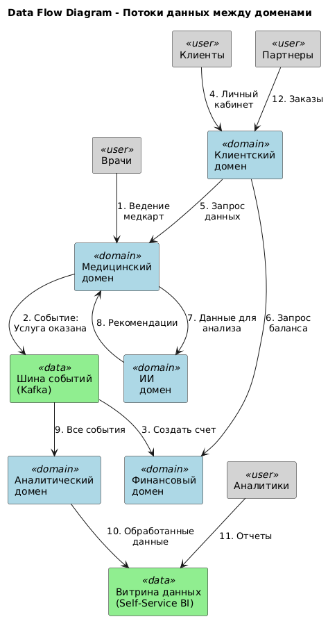

# Доменная декомпозиция системы "Будущее 2.0"

## 1. Разделение системы на домены

### Выделенные домены

#### 1.1 Медицинский домен
**Ответственность:** Все медицинские процессы и данные пациентов
- Медицинские карты и истории болезни
- Работа врачей и медперсонала
- Медицинское оборудование и инвентарь
- Процедуры и назначения

**Ключевые сущности:** Пациент, Медкарта, Процедура, Назначение, Врач

#### 1.2 Финансовый домен
**Ответственность:** Банковские и финансовые операции
- Счета и платежи за медуслуги
- Кредиты и кредитный скоринг
- Финансовая отчетность
- Банковские продукты

**Ключевые сущности:** Счет, Транзакция, Кредит, Платеж

#### 1.3 ИИ домен
**Ответственность:** Искусственный интеллект для медицины
- Помощь в диагностике
- Анализ медицинских данных
- Рекомендации для врачей
- Предиктивная аналитика

**Ключевые сущности:** ML-модель, Диагноз, Рекомендация, Прогноз

#### 1.4 Клиентский домен
**Ответственность:** Взаимодействие с клиентами
- Личный кабинет пациента/клиента банка
- Запись на прием
- Уведомления и коммуникации
- Обратная связь

**Ключевые сущности:** Профиль клиента, Запись, Уведомление

#### 1.5 Аналитический домен
**Ответственность:** Отчетность и витрины данных
- Сбор данных из всех доменов
- Self-service BI портал
- Дашборды для руководства
- Регуляторная отчетность

**Ключевые сущности:** Отчет, Метрика, Витрина данных, Дашборд

### Принципы разделения

1. **Автономность:** Каждый домен развивается независимо
2. **Владение данными:** У каждого домена своя база данных
3. **Четкие границы:** Домены общаются через события или API
4. **Команды:** Каждый домен = отдельная команда разработки

## 2. Потоки данных между доменами

### Описание ключевых потоков:

1. **Медицинский процесс → Биллинг**
    - Врач оказывает услугу и фиксирует в медицинском домене
    - Событие "Услуга оказана" отправляется в шину событий
    - Финансовый домен получает событие и создает счет

2. **Данные для ИИ-анализа**
    - ИИ домен запрашивает медицинские данные через API
    - Получает обезличенные данные для анализа
    - Возвращает рекомендации обратно в медицинский домен

3. **Клиентский опыт**
    - Личный кабинет агрегирует данные из разных доменов
    - Запрашивает медицинскую информацию и финансовый баланс
    - Предоставляет единый интерфейс для пациента

4. **Аналитика**
    - Все домены отправляют события в шину
    - Аналитический домен собирает и обрабатывает события
    - Формирует витрины данных для self-service BI

## 3. Обоснование разделения на домены

### 3.1 Решаемые проблемы

| Проблема | Как решается доменной архитектурой |
|----------|-------------------------------------|
| **Невозможность независимого развития бизнесов** | Каждый домен развивается автономно. Изменения в банковских продуктах не затрагивают медицину |
| **Сложность интеграции новых компаний** | Новая компания = новый домен. Подключается через стандартные интерфейсы без изменения существующих |
| **Низкая производительность (отчеты часами)** | Разделение OLTP и OLAP. Аналитика в отдельном домене с оптимизированным хранилищем |
| **Смешение медицинских и финансовых данных** | Полная изоляция данных. Каждый домен владеет только своими данными |
| **Монолитная архитектура DWH** | Декомпозиция на микросервисы. Нет единой точки отказа |

### 3.2 Преимущества для бизнеса

#### Ускорение Time-to-Market
- **Было:** 3 месяца на внедрение новой функции
- **Стало:** 2 недели
- **Почему:** Команды работают параллельно, не блокируя друг друга

#### Простая интеграция
- **Было:** 6 месяцев на интеграцию новой компании
- **Стало:** 1 месяц
- **Почему:** Стандартизированные интерфейсы, не нужно менять существующую логику

#### Масштабируемость
- **Было:** Вертикальное масштабирование ограничено
- **Стало:** Горизонтальное масштабирование каждого домена
- **Почему:** Независимые сервисы могут масштабироваться по потребности

#### Надежность
- **Было:** 95% доступность, сбой влияет на всю систему
- **Стало:** 99.9% доступность, изоляция сбоев
- **Почему:** Сбой в одном домене не останавливает другие

### 3.3 Технические преимущества

| Аспект | Улучшение | Обоснование |
|--------|-----------|-------------|
| **Производительность** | В 60 раз быстрее отчеты | Специализированные хранилища для аналитики |
| **Масштабируемость** | 50x увеличение пропускной способности | Горизонтальное масштабирование |
| **Гибкость** | Разные технологии для разных задач | Java для медицины, Python для ИИ, Go для финансов |
| **Поддержка** | -40% стоимость поддержки | Проще понимать и поддерживать отдельные домены |

### 3.4 Организационные преимущества

#### Автономные команды
- **Размер команды:** 5-7 человек вместо 50+
- **Ответственность:** Четкие границы, понятно кто за что отвечает
- **Скорость принятия решений:** Дни вместо недель

#### Упрощение разработки
- **Онбординг:** 2-3 недели вместо 2-3 месяцев
- **Фокус:** Команда глубоко понимает свой домен
- **Независимые релизы:** Не нужно синхронизировать с другими командами

### 3.5 Соответствие регуляторным требованиям

| Требование | Как обеспечивается |
|------------|-------------------|
| **ФЗ-152 (Персональные данные)** | Изоляция медицинских данных в отдельном домене |
| **Требования ЦБ РФ** | Финансовый домен с отдельной инфраструктурой |
| **PCI DSS** | Изоляция платежных данных |
| **Аудит** | Централизованный сбор событий для аудита |
